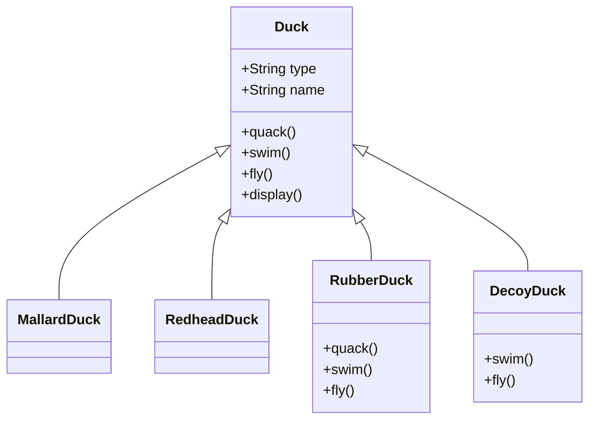
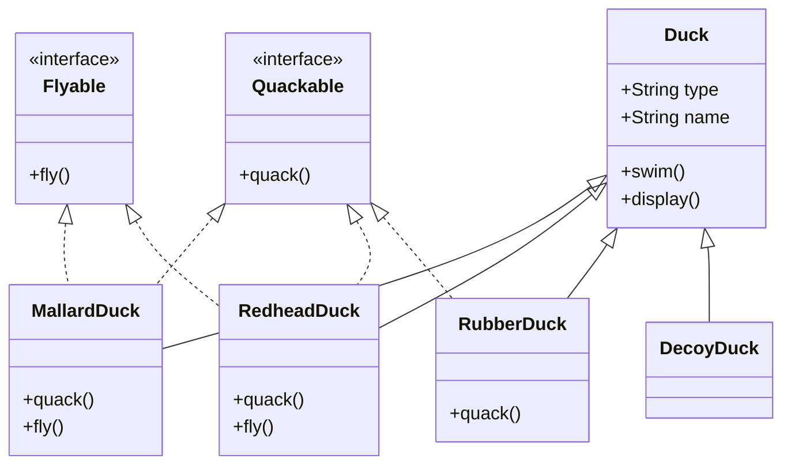
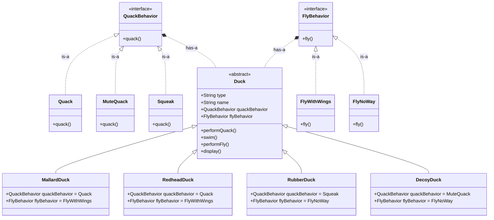

# 20240122: Strategy: Composición en vez de Herencia

<TagsLinks />

- Cuando se aplica herencia, las cosas en la clase padre afectan a todos los hijos.
	- Si se agrega algo en el padre, aquellos que no lo requieran deben sobrescribirlo.
	- La herencia facilita el uso de lo común en un único contexto pero dificulta el uso de lo común en otros contextos

- Cuando se desea que solamente algunas cosas sean heredados por algunos hijos

- Con Herencia: Behavior en la implementación
	- lo que es no común se puede extraer interfaces
	- los hijos que implementen las interfaces tendrán lo no común
		- Cada uno necesitará implementar lo que no es común

- Con Composición: Behavior en el tipo
	- lo que no es común se puede extraer a clases que implementen cierta interface
	- el padre usa el tipo
	- los hijos usan las implementaciones

