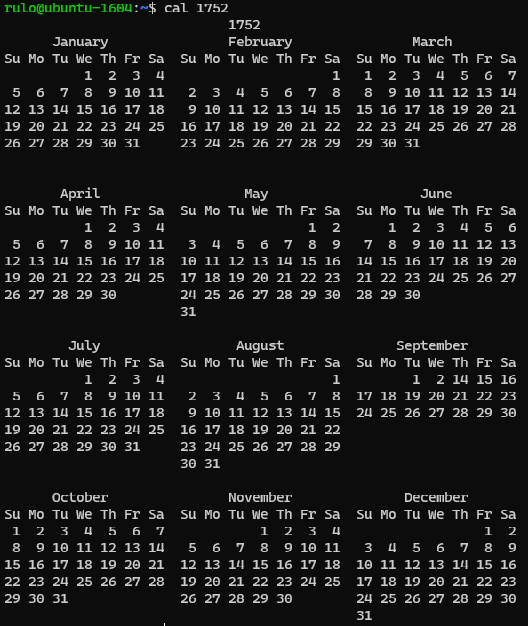

# 20230430: Fechas faltantes por el ajuste de calendario

<TagsLinks />

- Hay **fechas que no existen** en nuestro calendario. Fíjate en **setiembre de 1752**.
- Nuestro calendario tiene la particularidad de **no encajar exactamente** en el año solar.
- Para compensar esto en el ***Calendario Juliano***, que se instauró en el gobierno de **Julio César** (el 1 de Enero del ahora numerado 46 AC), se estableció tener un **día adicional** **cada 4 años**, sin excepción.
- A pesar de eso, hacia **1582**, durante el pontificado del **papa Gregorio XIII**, se tenía un notorio desfase de **10 días** y se procedió a instaurar un nuevo calendario corregido, que luego se denominó ***Calendario Gregoriano***.
	- Una corrección consistía en establecer que el **día adicional** sería agregado en años llamados ***bisiestos***
		- aquellos que son **múltiplos de 4** 
		- pero ***exceptuando*** aquellos años que terminaran en doble cero (**mútiplos de 100**)
			- Es decir, 1583 no es bisiesto, ni 1800, 1900
		- e ***incluyendo*** aquellos años que aunque terminaran en doble cero fueran **múltiplos de 400**
			- 1584 es bisiesto, y también 2000
	- Y la otra correción consitía en **eliminar los días de desfase**, haciendo que luego del jueves **4 de Octubre** de 1582 (que debía ser 14), el día siguiente fuera viernes **15 de octubre** de 1582.
		- [Year 1582 Calendar – Spain](https://www.timeanddate.com/calendar/?year=1582&country=16)
	- Esto se efectuó en países como Italia, España y Francia, pero **muchos países, como los anglos, no acataron el decreto papal**.
- **Los países anglos, efectuaron el cambio recién en 1752**, cuando el desfase del Calendario Juliano que seguían usando ya era de **11 días**.
	- La corrección consistió en **eliminar los días de desfase**, haciendo que luego del miércoles **2 de setiembre** de 1752 (que debía ser 13), el día siguiente fuera el jueves **14 de setiembre** de 1752.
		- [Year 1752 Calendar – United States](https://www.timeanddate.com/calendar/?year=1752&country=1)
- Es importante resaltar que los **programas informáticos**, como cal y ncal, muestran el calendario con el desfase corregido como se realizó en los países anglos.
	- En esta página puedes revisar el calendario con los desfases corregidos en los demás países: 
		- [Julian to Gregorian Calendar: How We Lost 10 Days](https://www.timeanddate.com/calendar/julian-gregorian-switch.html)