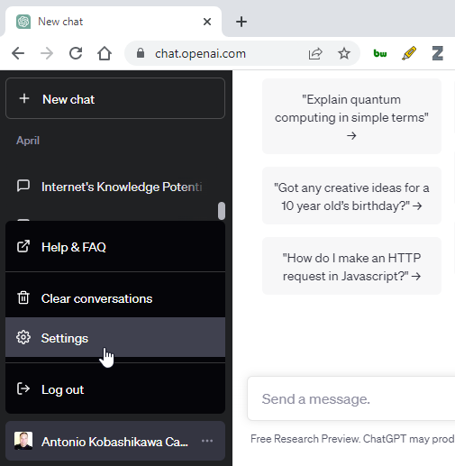
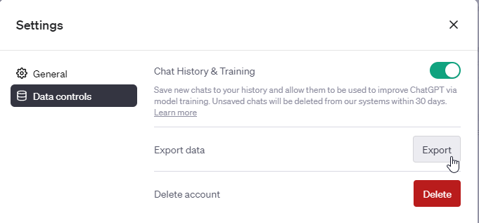

# 20230511: Cómo exportar los chats con ChatGPT

<TagsLinks />

- En el menú. haciendo click en los tres puntos al lado del nombre, elegir *Settings*
	- 
- En Settings, Data controls, Export.
	- Avisará que un archivo será enviado al email del usuario
	- 
	- 