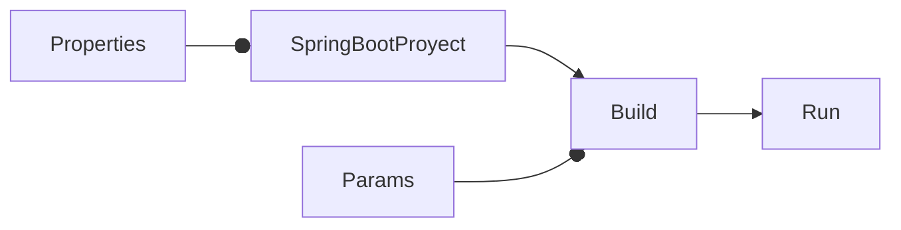

# Cómo usar una configuración externa en Spring Boot

<TagsLinks />



- Por default, `application.properties` se busca en estas ubicaciones:
	- `file:./config/`
	- `file:./`
	- `classpath:/config/`
	- `classpath:/`
- Es decir, se puede tener `src\main\resources\application.properties` que será incluido en el war, y `config\application.properties` en la carpeta donde se ejecute el war.
- Referencia: [24. Externalized Configuration](https://docs.spring.io/spring-boot/docs/2.1.13.RELEASE/reference/html/boot-features-external-config.html)
## Usando un nombre diferente

- También es posible indicar un directorio de configuración con nombre distinto.

```sh
mvn clean install

java -Dspring.config.location=conf/application.properties -jar target/hello-0.0.1.war
```

- Alternativamente, se puede agregar la siguiente opción en `application.properties`:

```properties
spring.config.additional-location=file:${user.dir}/conf/
```

- De ese modo, ya no es necesario indicar ese parámetro en el comando:

```sh
mvn clean install

java -jar target/hello-0.0.1.war

```