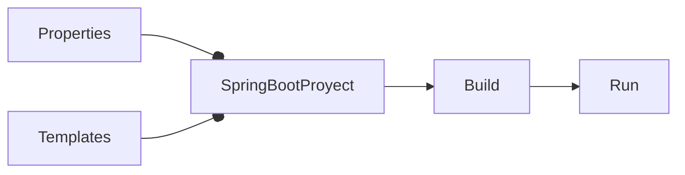

# Cómo crear una página de error en Spring Boot

<TagsLinks />



- Por default, cuando ocurre algún error para mostrar una página, se muestra la página Whitelabel, a menos que haya una página de error explícita.
- El template de una página de error explícita se puede colocar en `src\main\resources\templates\error.html`:

```html
<h1>Error</h1>
<dl>
	<dt>timestamp</dt>
	<dd><span th:text="${timestamp}"></span></dd>

	<dt>path</dt>
	<dd><span th:text="${path}"></span></dd>

	<dt>status</dt>
	<dd><span th:text="${status}"></span></dd>

	<dt>exception</dt>
	<dd><span th:text="${exception}"></span></dd>

	<dt>message</dt>
	<dd><span th:text="${message}"></span></dd>

	<dt>error</dt>
	<dd><span th:text="${error}"></span></dd>

	<dt>errors</dt>
	<dd><span th:text="${errors}"></span></dd>

	<dt>trace</dt>
	<dd><span th:text="${trace}"></span></dd>

</dl>
```
- Una página de error específica se puede colocar en `src\main\resources\templates\error\`. Por ejemplo, `src\main\resources\templates\error\404.html`