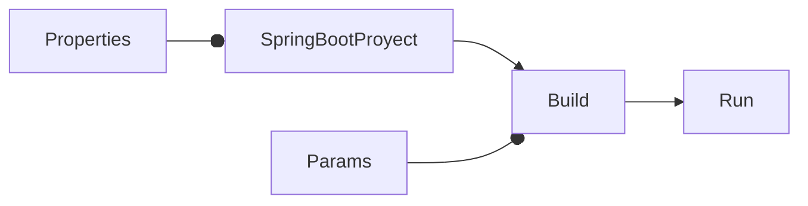
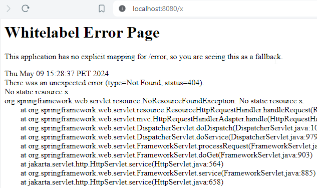
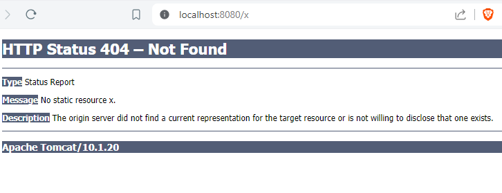

# Cómo indicar no usar Whitelabel en Spring Boot

<TagsLinks />



- Por default, cuando ocurre algún error para abrir una página, se muestra la página Whitelabel.



- Al correr el proyecto, se puede indicar que no se use:

```sh
mvn clean install

java -Dserver.error.whitelabel.enabled=false -jar target/hello-0.0.1.war
```



- Alternativamente, se puede agregar la siguiente opción en `application.properties`:

```properties
server.error.whitelabel.enabled=false
```

- De ese modo, ya no es necesario indicar ese parámetro en el comando:

```sh
mvn clean install

java -jar target/hello-0.0.1.war
```

- Cuando ya no hay Whitelabel para mostrar los errores, estos se mostrarán en la consola.