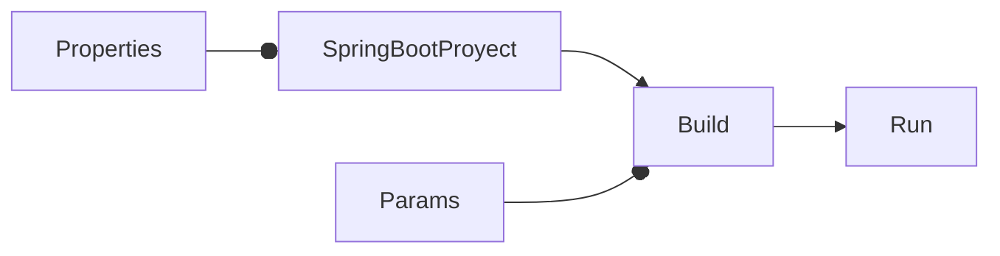

# Cómo indicar el port para Spring Boot

<TagsLinks />



- Por default, port = 8080. Pero se puede indicar otro al correr el proyecto.

```sh
mvn clean install
java -Dserver.port=9090 -jar target/hello-0.0.1.war
```

- Alternativamente, se puede agregar la siguiente opción en `application.properties`:

```properties
server.port=9090
```

- De ese modo, ya no es necesario indicar ese parámetro en el comando:

```sh
mvn clean install

java -jar target/hello-0.0.1.war

```

- http://localhost:9090