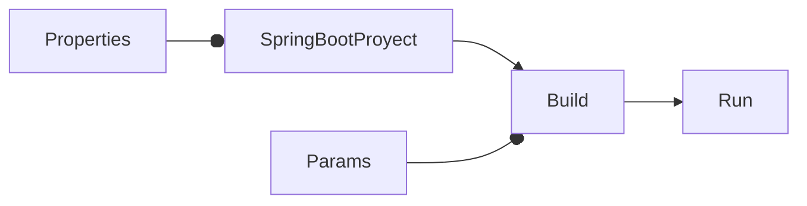

# Cómo ver mensajes más detallados en Spring Boot

<TagsLinks />



- Se puede indicar al correr el proyecto.

```sh
mvn clean install
java -Dserver.error.include-message=always -Dserver.error.include-stacktrace=always -Dserver.error.include-exception=true -jar target/hello-0.0.1.war
```

- Alternativamente, se puede agregar las siguientes opciones en `application.properties`:

```properties
server.error.include-message=always
server.error.include-stacktrace=always
server.error.include-exception=true
```

- De ese modo, ya no es necesario indicar esos parámetros en el comando:

```sh
mvn clean install

java -jar target/hello-0.0.1.war
```