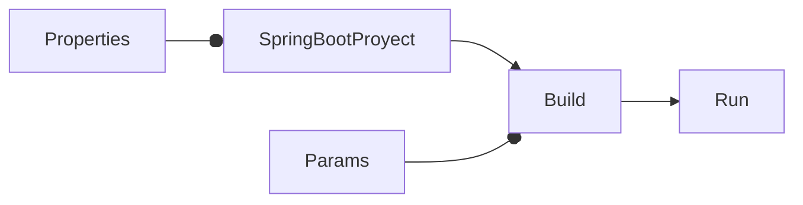

# Cómo usar un public externo en Spring Boot

<TagsLinks />



- Por default, el contenido estático se pone en `src\main\resources\static` y es incluido en el compilado.
- Es posible indicar usar un directorio externo al compilado.

```sh
mvn clean install

java -Dspring.web.resources.static-locations=file:$(pwd)/public/ -jar target/hello-0.0.1.war
```

- Alternativamente, se puede agregar la siguiente opción en `application.properties`:

```properties
spring.web.resources.static-locations=file:${user.dir}/public/
```

- De ese modo, ya no es necesario indicar ese parámetro en el comando:

```sh
mvn clean install

java -jar target/hello-0.0.1.war
```