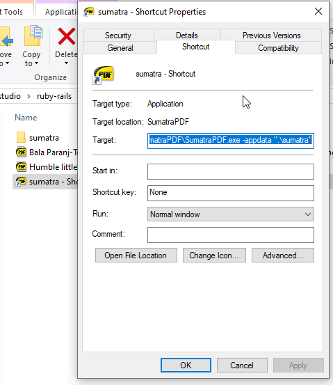

# Sesiones con Sumatra PDF

## Qué es SumatraPDF

- Sumatra PDF es un lector de documentos y libros electrónicos.
- Soporta los formatos pdf, epub, mobi, cbz, djvu, chm, entre otros formatos.
- Se distingue por su interfaz sencilla, su agilidad de operación y su bajo consumo de recursos.
- Es open source: [Free PDF Reader - Sumatra PDF](https://www.sumatrapdfreader.org/free-pdf-reader)

## Sesiones

- Una sesión permitiría tener colecciones de documentos que podrían abrirse todos a la vez, facilitando proseguir una tarea relacionada, por ejemplo.
- Sumatra maneja una sesión única. Permite abrir varios documentos a la vez y si uno cierra el programa, la siguiente vez que lo abra, verá esos mismos documentos.
	- Para realizarlo, guarda los datos de la sesión en una carpeta predeterminada.
	- En `%LOCALAPPDATA%\SumatraPDF-settings.txt`.
	- Por ejemplo: `C:\Users\KobashikawaA\AppData\Local\SumatraPDF\SumatraPDF-settings.txt`
- Aunque Sumatra PDF no maneja múltiples sesiones, hay una característica no documentada que se puede usar para tener algo parecido.
	- [Sessions in sumatra](https://forum.sumatrapdfreader.org/t/sessions-in-sumatra/1272)
- El parámetro **appdata** permite indicar una carpeta diferente donde guardar los datos de la sesión.
	- Por ejemplo, para que use la carpeta local sumatra: `C:\Users\KobashikawaA\AppData\Local\SumatraPDF\SumatraPDF.exe -appdata ".\sumatra"`

## La idea

- Se puede crear una subcarpeta `sumatra`. 
- Luego, haciendo click derecho sobre la subcarpeta, podemos crear un shortcut o acceso directo `sumatra - Shortcut`
- Finalmente, haciendo click derecho sobre el acceso directo, Propiedades, podemos indicar el Target que abra Sumatra usando la subcarpeta para guardar los datos de sesión.
	- Target: `C:\Users\KobashikawaA\AppData\Local\SumatraPDF\SumatraPDF.exe -appdata ".\sumatra"`
- De ese modo, al hacer click sobre el acceso directo se hará uso de una sesión diferente guardada en una subcarpeta local.

## Limitaciones

- Solamente se puede tener abierta una sesión a la vez.

## Más ideas

- Si el nombre de una subcarpeta comienza con un punto, normalmente permanece oculta.
- Entonces, si la subcarpeta se renombra como `.sumatra` ya no aparecería, a menos que se habilite mostrar los archivos ocultos.
- Si se renombre la carpeta como `.sumatra`, entonces el Target del acceso directo también debería cambiar a `C:\Users\KobashikawaA\AppData\Local\SumatraPDF\SumatraPDF.exe -appdata ".\.sumatra"`