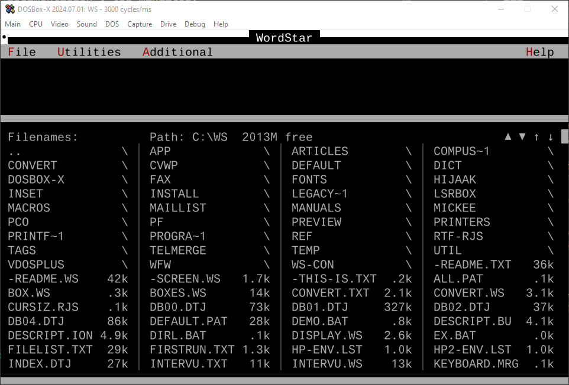

# WordStar en Windows 10

<TagsLinks />

Recientemente, Robert J. Sawyer, el reconocido escritor de ciencia ficción, publicó que escribía sus novelas usando WordStar, el mejor procesador de textos que haya conocido.

No es el único que opina igual, también se cuenta entre sus usuarios a Anne Rice, autora de "Entrevista con el Vampiro" y George R. R. Martin, autor de "Juego de Tronos".

Y eso que WordStar es abandonware. Es decir, software muy antiguo que ha dejado de mantenerse e incluso de distribuirse de manera oficial. 

Las copias que circulan por ahí se debe a una comunidad de usuarios entusiastas. Como Robert J. Sawyer.

Tampoco corre ya en los sistemas operativos modernos, a menos que se haga uso de algún emulador.

En su página sobre el tema, [Science Fiction Writer Robert J. Sawyer: WordStar 7 Archive](https://sfwriter.com/ws7.htm), cuenta más al respecto y facilita el procedimiento para hacer lo mismo.

## DOSBox-X

- WordStar corre en DOS 7.
- Para que corra en Windows 10, hay que instalar un emulador.
- El emulador recomendado es DOSBox-X
 [DOSBox-X - Accurate DOS emulation for Windows, Linux, macOS, and DOS](https://dosbox-x.com/)
- Actualmente, la versión para Windows cuesta un poco de encontrar
    - [Build failure of 2024.07.01 Windows installer release and alternative download link · Issue #5086 · joncampbell123/dosbox-x](https://github.com/joncampbell123/dosbox-x/issues/5086)
    - [Prepare for release · joncampbell123/dosbox-x@214c048](https://github.com/joncampbell123/dosbox-x/actions/runs/9754660669)
        - https://github.com/joncampbell123/dosbox-x/actions/runs/9754660669/artifacts/1658029715
            - Buscar el setup.exe en la sección Artifacts
                - `dosbox-x-windows-20240702034526-setup.exe.zip`
- Descomprimo y luego corro el instalador.
    - Por ejemplo, en `C:\DOSBox-X`
    - Para la versión de DOS, elijo la 7
- Al ejecutar DOSBox-X, aparece el prompt `Z:\>`

## Configurando DOSBox-X para usar WordStar

- Sawyer facilita un link para descargar su versión de WordStar, incluyendo la documentación y los manuales.
    - https://www.goatley.com/wordstar/sawyer-wordstar-7-archive-release-1.5.zip 
- Descomprimo en `C:\dos-c\WP`
- En el menú de DOSBox-X, _Drive_, C, _Mount folder as hard drive_, elijo el drive C y el folder `C:\dos-c`
- Corro WordStar

```sh
C:\
cd WS
ws
```

- El montaje del drive se tendría que hacer cada vez que se ingresa a DOSBox-X. Pero se puede automatizar, agregando en el archivo de configuración `dosbox-x.conf` una línea como:

```sh
mount C: C:\dos-c
```

