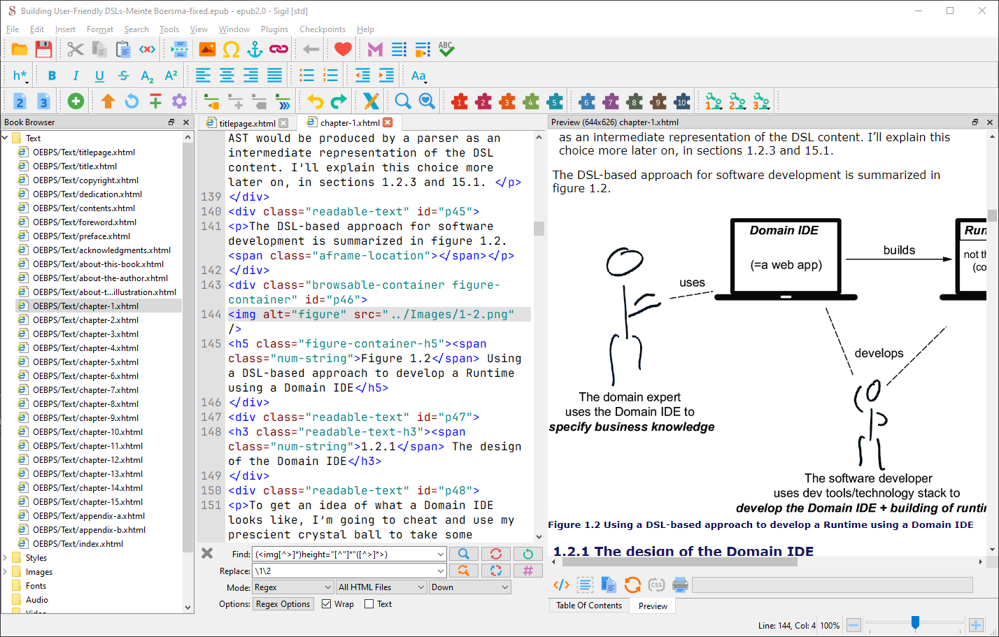
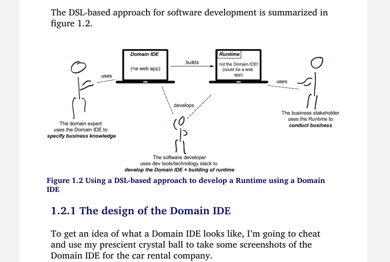

# Sigil: Corrigiendo imágenes de un epub

<TagsLinks />

## El problema
- Abro un epub en el lector Sumatra y las imágenes se muestran con demasiado ancho, haciendo ilegible la mayor parte.


## La herramienta
- Encuentro que puedo editar el epub con ayuda de Sigil.

## La Solución
- Cuando reviso las etiquetas img de las imágenes, veo que tienen indicado un número como ancho fijo.
- Dado que los epub se han hecho para adaptarse a los dispositivos, no debería ser necesario especificar un ancho fijo.
    - Me parece que funcionaría mejor indicar un ancho relativo, del 100% del ancho de la pantalla.
- Para la img de una figura, indico width="100%" y borro el atributo height.
    - Al guardar, veo que Sumatra refresca la página y ya puedo ver la imagen completa.
- Tendría que repetir esto para todas las imágenes.
    - Antes de hacerlo, pruebo si usando CSS podría indicar que se usar 100% para el ancho de todas las figuras, a pesar de lo que dijera el atributo width. Sin embargo no me funcionó.
- Para poder hacer el cambio en todas las etiquetas img del documento, noto que **Sigil tiene una función de reemplazo que admite expresiones regulares**. Consultando con DeepSeek, llegamos a las siguientes expresiones para eliminar tanto el atributo height como el width de todos los documentos.

```
# Eliminar solo width
find: (]*)width="[^"]*"([^>]*>)
replace: \1\2

# Eliminar solo height
find: (]*)height="[^"]*"([^>]*>)
replace: \1\2
```





